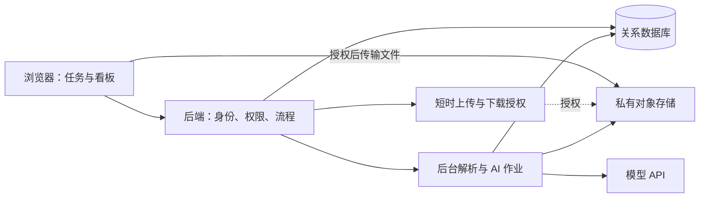

# Teamup 产品设计技术可行性分析

**结论：核心协作产品技术可行，存储方案已确定为服务器云端存储+本地可下载，仍需补齐验收规则并收缩 AI 范围。** 主要工作是把任务、人员、文件版本与验收记录可靠地串起来，无须先训练模型。按现有材料，适合先做可供少量真实团队使用的网页试用版；尚不足以承诺完整商业化产品在指定日期交付。

分析日期：2026-09-23。依据为本地仓库当前的 [产品首页](../README.md)、[项目拆分与认领](项目总览、拆分与分工认领.md)、[交付与验收设计](多环节多分工成果交付与协同验收.md)、[版本数据库](版本数据库.md)及[项目记录](../%E5%8E%9F%E5%A7%8B%E8%B5%84%E6%96%99/%E6%B5%8B%E8%AF%95%E9%A1%B9%E7%9B%AE%E5%8E%9F%E5%A7%8B%E8%AE%B0%E5%BD%95.md)。仓库主要提供设计文档和体验资料，本次没有可运行产品的测试证据；以下难度、排期和容量均为工程判断或建议，不是已测结果。

## 1. 逐项判断

| 功能 | 可行性与难度 | 关键缺口及首版建议 |
| --- | --- | --- |
| 项目创建、邀请码、成员加入 | 高，较低 | 邀请码不是身份凭证；登录后加入，支持过期、撤销和尝试次数限制 |
| 纵向阶段、横向分工 | 高，中等 | 先用“阶段 × 职能组”网格，每格包含任务；任意连线和复杂调度后置 |
| 意向申请与组长审批 | 高，中等 | 一个任务指定一个负责者，可有多个协作者；保留调整历史，防止同时审批冲突 |
| 文件上传、下载、版本保留 | 高，中等 | 需要服务器与对象存储；明确版本归属、上传失败处理、配额和删除规则 |
| 提交、退回、重新提交、验收 | 高，中高 | 当前文档以界面展示为主，缺少状态与权限规则；这是首版最应投入的模块 |
| 个人仪表盘、团队看板 | 高，中等 | 指标取自同一任务与验收数据；“完成”应以验收通过为准 |
| 截图或打印导出 | 高，较低 | 单独设计汇报页面，避免直接截取有横向滚动的工作界面 |
| AI 拆分建议 | 可做辅助，中等 | 输出草稿，人工确认；须检查日期、缺失字段和任务依赖 |
| AI 成果检查 | 有条件可行，较高 | 限定文档类型和验收标准，给出依据；不能保证学术正确性或自动判定合格 |
| 个人智能总结与评价 | 总结可行，公平评分依据不足 | 对应页面目前为空；先实现带记录引用的事实摘要，不自动排名 |

## 2. 必须先解决的设计冲突

### 2.1 存储方案已调整：服务器云端存储+本地可下载

浏览器中的本地数据不会自动变成其他组员可访问的共享记录。localStorage 容量也不适合作为团队文件库；IndexedDB 虽可存较大数据，仍受浏览器配额、清理机制和设备边界约束。[MDN 存储说明](https://developer.mozilla.org/en-US/docs/Web/API/Storage_API/Storage_quotas_and_eviction_criteria)

已采纳的产品方案为：**网页访问，服务器云端存储+本地可下载。** 团队共享数据与文件版本以云端为准，成员可按权限下载指定版本；本地修改后重新上传形成新版本，不自动覆盖云端文件。本地缓存仅用于草稿与界面偏好。 首版在线提交，断网时明确显示“尚未提交”；暂不做离线修改自动合并。产品可以保持轻量，但共享数据必须有统一来源。

### 2.2 “保留版本”和“组长可删除”需要一致规则

建议区分普通文件删除与已验收成果归档。普通删除先进入回收站；已被验收或被下游任务引用的版本，不允许无痕删除。所有删除记录操作者和时间。回收站及历史版本是否计费，必须对用户明确。

首版采用“每次上传一个不可覆盖的文件对象＋数据库中的版本记录”。同名文件不等于同一版本；系统生成对象编号，显示名称仍用用户文件名。先不做 Office 在线协同编辑、全文差异比较和自动合并。

### 2.3 “AI 审核”必须拆成检查与决定

上传了文件、模型读到了文件、模型判断符合要求，是三个不同状态。扫描件、图片、表格或解析失败的段落都可能造成信息缺失。

建议流程为：负责人填写验收清单 → 提交者上传指定版本 → 系统提取文本 → AI 按清单提出问题并引用片段 → 负责人通过或退回。AI 失败时仍可人工验收。界面应标明实际检查的文件、版本和无法读取的部分。

### 2.4 文件数量不能直接代表贡献

一次关键建模或需求澄清可能比多次小文件上传更重要。平台只能观测已记录的活动，无法完整观察线下讨论和实际投入。首版展示负责的任务、验收通过的成果、协作记录和本人补充说明。AI 负责整理这些事实，评价由成员与负责人补充，允许纠错。

## 3. 推荐的最小架构

这是建议架构，未部署。前端沿用团队最熟悉的框架；后端用一套熟悉的框架承载业务，配一个关系数据库和私有对象存储即可。初期不需要微服务、向量数据库、知识图谱或多人实时编辑引擎。AI 作业可先用数据库任务表和单独工作进程执行，避免长请求阻塞用户操作。

对象存储可通过短时签名 URL 授权上传，避免将长期云端密钥放入浏览器。服务端必须先验证成员权限、配额和目标文件，再签发授权；上传完成后确认真实大小与对象存在，才标记上传成功。[OSS 官方上传文档](https://www.alibabacloud.com/help/en/oss/user-guide/upload-files-using-presigned-urls)

建议的数据实体：用户、项目、项目成员、阶段、职能组、任务、任务申请、任务依赖、文件、文件版本、提交、验收、操作事件、AI 作业。每份提交可以引用多个固定版本，验收绑定这份提交，不能指向会变化的“最新文件”。

权限须在后端逐次验证：组员管理自己的提交，负责人验收其负责范围，组长管理项目。退出项目后的访问权限立即撤销；已有短时下载链接的有效窗口应尽量短。API 密钥保存在服务端。私有文件不得因为源代码仓库公开而被公开。

## 4. 验收流程应先于复杂界面确定

建议状态：未开始 → 进行中 → 待验收 → 已通过；待验收可以退回至待修改，再次提交后回到待验收。“是否阻塞”作为独立属性展示。

必须确定以下业务规则：

1. 只有任务负责者或授权协作者能提交；审批者身份明确，自验收需要显式标记。
2. 提交后固定文件版本，修改成果必须创建新提交；验收意见保留。
3. 退回必须说明原因；通过和退回不可被两名审批者同时成功写入。
4. 第一版采用顺序阶段，阶段全部必需任务通过才进入下一阶段；如需要并行依赖，必须检测循环，并区分强制阻塞与仅提醒。
5. 上游成果通过后再变更，要标记受影响下游并请求复核，不能静默替换下游所用文件。
6. 更换负责者不改写历史提交者；被退回不删除已发生的工作记录。

并发审批可用事务和状态版本号控制：提交验收时同时检查当前状态，冲突则提示刷新。关系数据库已有事务与行锁机制，但仍需应用层正确设计。[PostgreSQL 行锁文档](https://www.postgresql.org/docs/17/explicit-locking.html)

## 5. AI 的可实现边界

首版可以只做“任务要求＋提交文本”的检查，限定可解析文本的 DOCX、PDF 或用户粘贴文字。扫描件、复杂 Excel、图片理解与超长材料后置。遇到不支持的格式仍允许上传和人工审核，不应假装完成检查。

建议输出字段：验收项、判断（满足／可能不足／无法判断）、证据位置、改进建议。没有证据时必须返回无法判断。结构化输出可降低格式错误，但结构正确不代表结论正确，且模型、区域和输入类型的支持范围需要选型时核对。[模型结构化输出文档](https://docs.modelstudio.console.alibabacloud.com/en/model-studio/qwen-structured-output)

所有材料按待分析数据处理，不能让文件内的指令改变验收要求或触发系统操作。不要向模型开放成员管理、删除或通过验收的权限。只发送当前任务必要材料，不把整个团队文件库默认送入模型服务。

AI 作业应记录文件版本、验收清单版本、模型及提示词版本；内容不变时复用结果。限制单次输入长度、每组调用次数、超时与重试次数，并展示失败状态。

建议先人工标注约 30 份不同质量的小样本，包含缺项、相互矛盾、扫描件和诱导指令。观察漏检、误报、证据是否真实、人工修改时间及每次费用。这是探索性验证，不足以证明跨课程泛化能力；只有实际减少负责人工作量才保留该功能。

## 6. 容量与成本判断

“每组免费 10 GB”是运营承诺，不是技术难点，暂不建议直接作为上线默认配置。若 100 组均用满，就是约 1 TB；下载流量、历史版本、备份、解析、模型调用和运行服务还会产生额外成本。需明确 10 GB 是所有版本合计还是只统计当前版本。

月成本可按以下模型估算：基础计算与数据库＋平均占用容量×存储单价＋下载流量×流量单价＋请求费用＋模型输入输出费用＋备份及日志费用。这里未给出云厂商报价，也未验证实际负载，不据此承诺月费。

试用版可暂定每组 1 GB、单文件 20 MB、每组每天 10 次 AI 检查，作为可配置的测试边界，而非最终定价。上传前预留配额，并发上传也要计入；失败或过期释放预留量。只做“先查询剩余额度再上传”会出现多人同时超额的问题。

## 7. 首版范围与排期判断

项目记录写明三人分工及 10 月 11 日目标。从本次分析日期到该日期相隔约 18 天，但实际可开发工时、后端经验和部署条件尚未确认。以下是有条件的迭代安排，不是交付保证。

| 时间窗口 | 应交付的结果 | 退出条件 |
| --- | --- | --- |
| 9 月 23—25 日 | 权限、状态、数据关系和界面草图；验证登录及上传部署链路 | 技术成员能独立跑通服务、数据库与私有文件访问 |
| 9 月 26—30 日 | 建项目、邀请、分工、上传、提交、人工退回与通过 | 两台设备用不同账号跑通完整闭环 |
| 10 月 1—4 日 | 版本历史、基础看板、汇报页；可选 AI 文本检查 | AI 关闭或失败不影响核心使用 |
| 10 月 5—8 日 | 少量真实团队试用、修复流程和权限问题 | 无跨项目越权、无验收版本错配、无明确数据丢失问题 |
| 10 月 9—11 日 | 稳定演示、整理试用结果和发布材料 | 能恢复备份，能完成一轮独立使用 |

若 9 月 30 日仍不能完成多账号人工验收闭环，应删除 AI、复杂泳道拖拽和高级统计，优先交付能真实协作的版本。将“发布与商业化”拆开：试用发布可作为当前目标，收费、支付、客户支持和稳定运营仍需额外工作。

首版保留：项目与成员、固定阶段、手动分工、任务与附件、版本历史、人工验收、基础看板、汇报页。后置：自动公平评分、智能全局排期、原生 PPT 生成、任意文件 AI 审核、离线同步、即时聊天、在线 Office 编辑和收费套餐。

## 8. 开发前验证清单

- [ ] 不同账号、不同设备加入同一项目并看到一致任务；同时修改产生冲突提示而非静默覆盖。
- [ ] 两人同时审批、重复点击提交、刷新重试不会生成重复结果。
- [ ] 修改 URL 或文件编号也不能访问其他项目数据；退出成员不能继续获取下载授权。
- [ ] 上传中断、超额、格式不支持时反馈明确，未完成文件不计入有效提交。
- [ ] 上传 V2 后，V1 的验收记录和下游引用仍能准确打开 V1。
- [ ] 通过、退回、重新提交、换人、上游变更均有可追溯记录。
- [ ] AI 超时、解析失败及无依据输出可被识别，不阻断人工验收。
- [ ] 初步按 10 组、每组 5 人进行试用负载检查，记录非 AI 操作延迟与错误；规模是测试起点，不是承诺容量。
- [ ] 完成一次数据库与文件恢复演练；截图导出包含完整内容，长中文标题不被截断。
- [ ] 让真实小组独立完成一次提交和退回，观察是否仍必须回到群聊解释操作。

**立项建议：可以推进，但先验证“任务—指定文件版本—人工验收—进度更新”的闭环。** 技术成熟度足够；真正未验证的是规则是否符合课程协作习惯、团队能否在有限工时内实现，以及用户是否愿意持续把交付过程记录到平台。

[返回产品首页](../README.md)
