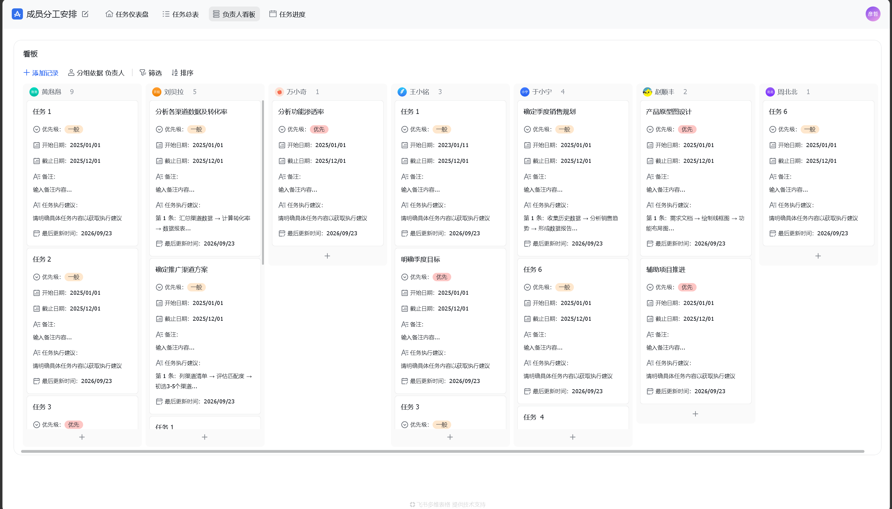

#### 一、核心功能说明

本功能是产品核心功能，也是用户日常使用状态。

##### 1、个人工作界面
呈现形式：仪表盘
包括内容：

	当前任务说明与截止时间
	前置任务文件
	成果提交与反馈

	个人分工说明
	已完成任务列表
	未来任务列表

##### 2、项目进度界面
呈现形式：可滑动泳道流程图
包括内容：

	当前任务阶段
	已提交成果
	各分工任务完成情况
	各分工负责人

##### 3、团队工作界面
呈现形式：数据列表
样例：

包括内容：

	按人员任务统计
	按人员贡献说明（也许需要AI）

^d1ca0a

##### 4、数据库管理界面
[版本数据库](版本数据库.md)
